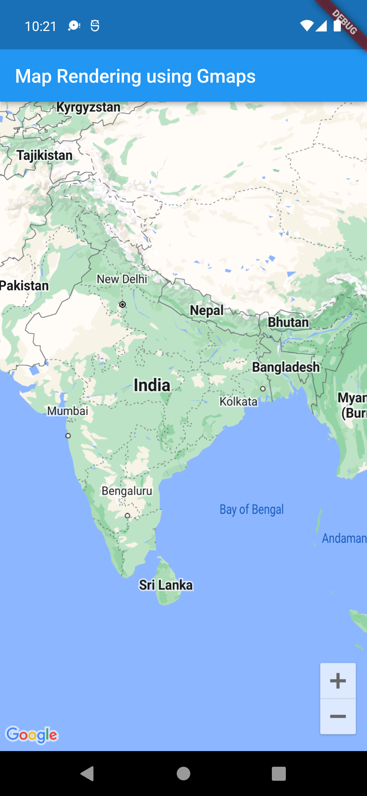
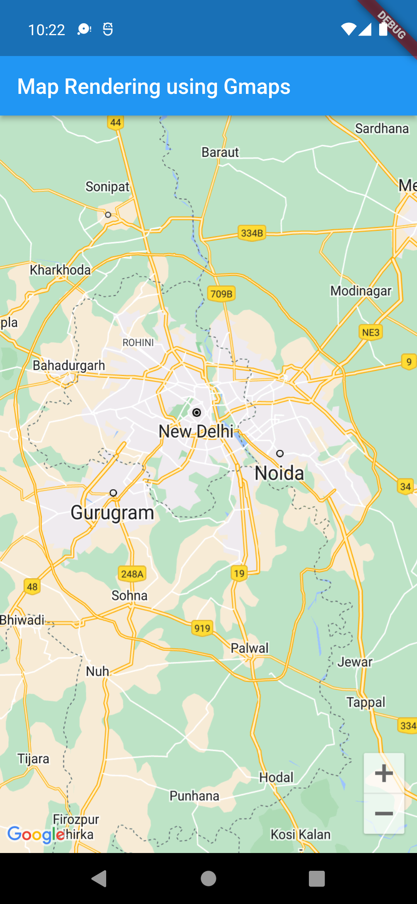
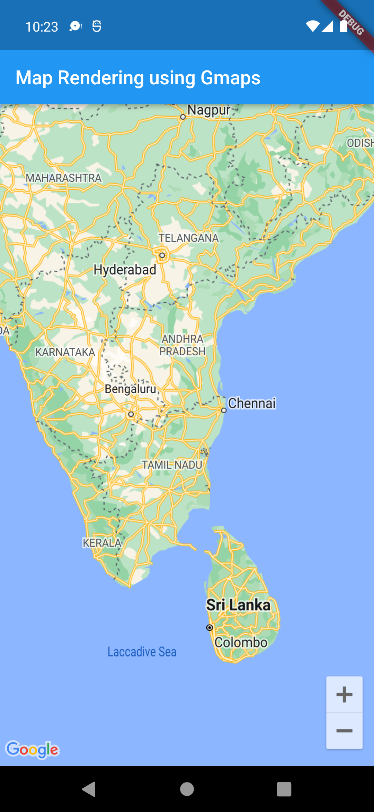
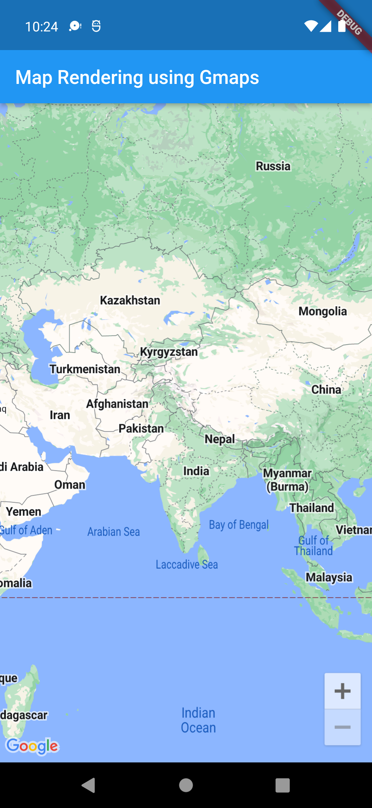

# gmaps_polygon

A new Flutter project.

## Getting Started

This project is a starting point for a Flutter application.

A few resources to get you started if this is your first Flutter project:

- [Lab: Write your first Flutter app](https://docs.flutter.dev/get-started/codelab)
- [Cookbook: Useful Flutter samples](https://docs.flutter.dev/cookbook)

For help getting started with Flutter development, view the
[online documentation](https://docs.flutter.dev/), which offers tutorials,
samples, guidance on mobile development, and a full API reference.

Please make sure you have the correct access rights
and the repository exists.
PS C:\Users\rento\Desktop\Polygon Flutter\gmaps_polygon> git remote add origin https://github.com/Sour3312/Flutter-Gmaps.git
PS C:\Users\rento\Desktop\Polygon Flutter\gmaps_polygon> git push origin master
Enumerating objects: 177, done.
Counting objects: 100% (177/177), done.
Delta compression using up to 8 threads
Compressing objects: 100% (149/149), done.
Writing objects: 100% (177/177), 200.25 KiB | 6.91 MiB/s, done.
Total 177 (delta 19), reused 0 (delta 0), pack-reused 0
remote: Resolving deltas: 100% (19/19), done.
To https://github.com/Sour3312/Flutter-Gmaps.git
 * [new branch]      master -> master
PS C:\Users\rento\Desktop\Polygon Flutter\gmaps_polygon> git

